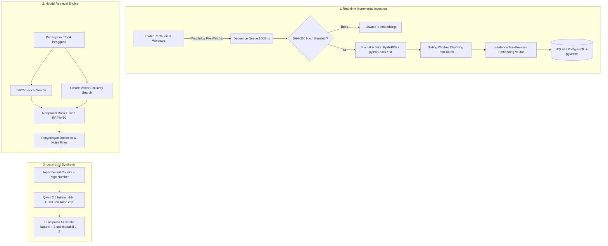

# SENA — AI Knowledge Search Hub (Local & 100% Offline)

> **Sistem Pencarian Folder & Dokumentasi Cerdas Berbasis Hybrid RAG (BM25 + Semantic Vector Embedding) dan Model AI Lokal (Qwen 2.5 GGUF) — 100% Gratis, Tanpa Kuota Cloud API, dan Menjaga Privasi Data Anda.**

[](https://www.python.org/)
[](https://fastapi.tiangolo.com/)
[-purple.svg)](https://github.com/QwenLM/Qwen2.5)
[-orange.svg)]()
[-brightgreen.svg)]()
[](https://microsoft.com)

---

## 📑 Daftar Isi
1. [Tentang Proyek](#1-tentang-proyek)
2. [Cara Kerja Sistem (How It Works)](#2-cara-kerja-sistem-how-it-works)
3. [Fitur Unggulan](#3-fitur-unggulan)
4. [Tutorial Instalasi & Menjalankan (Step-by-Step)](#4-tutorial-instalasi--menjalankan-step-by-step)
5. [Panduan Penggunaan Fitur Web UI](#5-panduan-penggunaan-fitur-web-ui)
6. [Katalog & Pemilihan Model AI Lokal](#6-katalog--pemilihan-model-ai-lokal)
7. [Struktur Direktori Proyek](#7-struktur-direktori-proyek)
8. [Pengujian (Testing)](#8-pengujian-testing)
9. [Keamanan & Privasi](#9-keamanan--privasi)

---

## 1. Tentang Proyek

**SENA** adalah mesin pencari pengetahuan internal (*Local Knowledge Hub*) yang memungkinkan Anda mencari, menelusuri, dan merangkum ribuan file dokumen (**PDF, DOCX, TXT**) yang tersebar di komputer Anda berdasarkan **makna konteks bahasa alami**, bukan hanya kecocokan nama file.

Berbeda dengan solusi cloud yang berbayar dan mengunggah dokumen rahasia Anda ke internet, SENA berjalan **100% lokal di CPU laptop/PC**:
- **$0 Biaya Cloud**: Tidak membutuhkan langganan OpenAI, Anthropic, atau Gemini API.
- **Privasi Terjaga**: Dokumen tidak pernah keluar dari harddisk komputer Anda.
- **Sintesis Gaya Perplexity AI**: Menyediakan kesimpulan naratif cerdas yang mengalir alami dengan sitasi dokumen `[1]`, `[2]` yang dapat langsung diklik untuk melompat ke halaman rujukan.

---

## 2. Cara Kerja Sistem (How It Works)

SENA bekerja menggunakan arsitektur **Hybrid Retrieval-Augmented Generation (Hybrid RAG)** yang terbagi ke dalam 3 alur utama:



### Penjelasan Detail Komponen:
1. **Incremental File Watcher (`app/ingestion/`)**:
   - Menggunakan pustaka `watchdog` untuk memantau perubahan folder (*Desktop, Downloads, Dokumen*) secara *asynchronous*.
   - **Stability Check**: Menunggu file selesai ditulis (1500 ms) agar file tidak rusak saat dibaca.
   - **SHA-256 Hashing**: Jika file hanya di-rename atau di-save tanpa mengubah isi teks, sistem tidak akan membuang waktu untuk melakukan re-embedding ulang.
2. **Page-Aware Extractor & Chunking (`app/chunking/`)**:
   - Memotong dokumen berukuran besar menjadi segmen berukuran ~500 token dengan overlap ~75 token.
   - Tetap mencatat **nomor halaman asli** (`page_no`) pada PDF dan DOCX sehingga Anda tahu persis halaman berapa yang dikutip AI.
3. **Hybrid Retrieval (BM25 + Semantic Cosine + RRF) (`app/retrieval/`)**:
   - **BM25Okapi**: Menangkap kata kunci teknis, singkatan, nama orang, dan kode unik secara presisi.
   - **Sentence Transformers (`all-MiniLM-L6-v2`)**: Menangkap makna konseptual (misal mencari *"resep rendang"* tetap menemukan teks *"olahan daging sapi santan pedas"*).
   - **Reciprocal Rank Fusion (RRF)**: Menggabungkan kedua hasil pencarian secara adil menggunakan rumus:
     $$\text{RRF}(d) = \sum_{m \in \{\text{bm25}, \text{vector}\}} \frac{1}{60 + \text{rank}_m(d)}$$
4. **Natural Narrative AI Synthesis (`app/llm/manager.py`)**:
   - Model lokal **Qwen 2.5 Instruct** membaca potongan konteks terbaik dan merangkumnya ke dalam bahasa Indonesia yang alami dan terstruktur, menyertakan nomor referensi `[1]`, `[2]`.

---

## 3. Fitur Unggulan

- ⚡ **Pencarian Kilat (<100 ms)**: Indeks hybrid tersimpan di memori dan basis data lokal berkecepatan tinggi.
- 🧠 **Kesimpulan AI Naratif Gaya Perplexity**: Memberikan jawaban langsung, intisari dokumen, poin-poin analisis, dan tombol sitasi sumber.
- 🎛️ **Dynamic Model Switcher**: Beralih bebas antara **Qwen 2.5 0.5B (~468 MB)** yang ultra-cepat atau **Qwen 2.5 1.5B (~1.06 GB)** untuk penalaran komprehensif.
- 📖 **Built-in Document Reader & Chat**: Buka dan baca isi teks dokumen lengkap langsung di web UI, serta lakukan tanya-jawab interaktif khusus dokumen tersebut.
- 📂 **Integrasi Windows Explorer**: Tombol 1-klik untuk *"Buka File"* langsung dengan software default Windows atau *"Buka Folder"* di file explorer.
- 🛡️ **Zero Cloud Dependency**: Dapat digunakan di tempat terpencil tanpa koneksi internet sekalipun (di pesawat, area tambang, atau jaringan tertutup).

---

## 4. Tutorial Instalasi & Menjalankan (Step-by-Step)

### Prasyarat Sistem:
- **Sistem Operasi**: Windows 10 / 11 (64-bit)
- **Python**: Versi 3.10 atau 3.11 (disarankan)
- **RAM**: Minimal 4 GB (disarankan 8 GB ke atas)
- **Penyimpanan**: Ruang kosong minimal ~1.5 GB untuk file model AI lokal.

---

### Langkah 1: Clone Repository
Buka terminal (Command Prompt / PowerShell / Git Bash) lalu jalankan:
```bash
git clone https://github.com/Franklnir/sistem-pencarian-folder-dokemntasi-berbasis-RAG-dan-model-local.git
cd sistem-pencarian-folder-dokemntasi-berbasis-RAG-dan-model-local
```

### Langkah 2: Buat Virtual Environment (Disarankan)
```bash
python -m venv .venv
.venv\Scripts\activate
```

### Langkah 3: Pasang Dependensi
```bash
pip install -r requirements.txt
```
> **Catatan Dependensi LLM**: File `requirements.txt` telah mencakup pustaka `llama-cpp-python`, `sentence-transformers`, `pymupdf`, `python-docx`, dan `fastapi`.

### Langkah 4: Menjalankan Aplikasi

#### Cara 1: Menggunakan Script Otomatis (Paling Mudah)
Cukup klik ganda file **`run.bat`** di folder proyek, atau jalankan melalui terminal:
```bash
run.bat
```
*Script ini akan otomatis mengaktifkan environment, memeriksa model AI, menyalakan server, dan membuka browser Anda.*

#### Cara 2: Menjalankan via Python Manual
```bash
python run.py
```
Aplikasi akan aktif dan dapat diakses di browser pada alamat:
👉 **`http://127.0.0.1:8000`**

---

## 5. Panduan Penggunaan Fitur Web UI

### A. Melakukan Pencarian Cerdas
1. Ketik topik atau pertanyaan apa saja di kolom pencarian (misal: `"keamanan jaringan"`, `"resep kuliner"`, atau konsep apa pun).
2. Tekan **Enter** atau klik tombol **⚡ Cari Makna**.
3. Sistem akan menampilkan daftar file yang cocok berserta persentase relevansi dan cuplikan teks yang disorot kuning.

### B. Membaca Kesimpulan AI (Gaya Perplexity)
1. Tepat di atas hasil pencarian, kartu **✨ Kesimpulan AI** akan menyintesis temuan dokumen secara otomatis.
2. Anda dapat memilih 3 mode respon:
   - **⚡ Cepat**: Respon kilat 2-3 kalimat padat.
   - **⚖️ Balance** *(Default)*: Respon terstruktur dengan paragraf pengantar dan poin-poin penting.
   - **🧠 Thinking**: Respon mendalam dan analitis untuk dokumen teknis.
3. Klik tombol nomor rujukan seperti **`[1]`** atau chip dokumen di atasnya untuk langsung melihat kutipan aslinya.

### C. Chat Khusus Satu Dokumen (*Document Chat*)
1. Klik tombol **💬 Chat Dokumen** di navbar atas.
2. Pilih dokumen yang ingin Anda tanyakan dari daftar dropdown.
3. Ajukan pertanyaan spesifik — AI hanya akan menjawab menggunakan fakta dari dokumen tersebut!

### D. Mengatur Folder Pantauan
1. Klik tombol **📂 + Folder Pantau** di navbar.
2. Masukkan direktori lokal yang ingin dipantau (misal: `D:\Skripsi` atau `C:\Users\Nama\Documents`).
3. Sistem secara otomatis langsung mengindeks seluruh file PDF, DOCX, dan TXT di folder tersebut.

---

## 6. Katalog & Pemilihan Model AI Lokal

SENA dilengkapi dengan **Model Switcher** yang memungkinkan Anda memilih model AI yang paling cocok dengan kapasitas laptop Anda:

| Model | Ukuran File | Kebutuhan RAM | Kecepatan CPU | Rekomendasi Penggunaan |
| :--- | :--- | :--- | :--- | :--- |
| **Qwen 2.5 0.5B Instruct (Q4_K_M)** | **468 MB** | ~600 - 800 MB | ⚡ **Sangat Cepat (3 - 8 detik)** | **Pilihan Utama (Default)** untuk pencarian harian dan laptop spek hemat. |
| **Qwen 2.5 1.5B Instruct (Q4_K_M)** | **1.06 GB** | ~1.4 - 1.8 GB | 🐢 Standar (15 - 35 detik) | Untuk penalaran mendalam dan sintesis komparasi multi-dokumen. |

> **Cara Mengganti Model**:
> Buka Web UI -> Klik badge model di navbar atas atau klik **⚙️ Pemeliharaan** -> Pilih model yang diinginkan dan klik **"Gunakan Model Ini"**. Pergantian model berlangsung instan tanpa perlu restart server!

---

## 7. Struktur Direktori Proyek

```text
sistem-pencarian-folder-dokemntasi-berbasis-RAG-dan-model-local/
├── app/
│   ├── main.py                     # Entry point FastAPI & routing
│   ├── config.py                   # Konfigurasi setting, path resolver, model default
│   ├── api/
│   │   ├── search.py               # Endpoint pencarian hybrid & filter dokumen
│   │   ├── chat.py                 # Endpoint Tanya AI, switcher model & katalog
│   │   ├── files.py                # Endpoint pembaca dokumen & aksi Windows Explorer
│   │   ├── folders.py              # Endpoint manajemen folder pantau
│   │   ├── indexing.py             # Endpoint reindex & status pemindaian
│   │   └── health.py               # Endpoint healthcheck sistem
│   ├── ingestion/
│   │   ├── watcher.py              # Watchdog file listener (CREATE/MODIFY/DELETE/MOVE)
│   │   ├── queue.py                # Antrean debounce file 1000ms
│   │   ├── pipeline.py             # Pipeline incremental & pengecekan SHA-256
│   │   └── hashing.py              # SHA-256 hasher
│   ├── extractors/
│   │   ├── pdf.py                  # PyMuPDF extractor (dengan nomor halaman)
│   │   ├── docx.py                 # python-docx extractor (paragraf & tabel)
│   │   └── txt.py                  # Plain text multi-encoding extractor
│   ├── chunking/
│   │   └── chunker.py              # Sliding window chunker (~500 token)
│   ├── embedding/
│   │   └── model.py                # Model Sentence Transformers lokal
│   ├── retrieval/
│   │   ├── bm25.py                 # BM25Okapi lexical retriever
│   │   ├── semantic.py             # Cosine similarity vector retriever
│   │   └── hybrid.py               # Reciprocal Rank Fusion (RRF) algorithm
│   ├── llm/
│   │   └── manager.py              # Manajemen llama.cpp, in-context prompt tuning & downloader
│   ├── database/
│   │   ├── models.py               # Skema tabel SQLite / PostgreSQL
│   │   └── repository.py           # Repositori database lokal (WAL mode aktif)
│   ├── templates/
│   │   └── index.html              # Antarmuka web responsif & modern dark mode
│   └── static/
│       ├── css/app.css             # Desain antarmuka premium (Perplexity style)
│       └── js/app.js               # Logika interaktif client-side & SSE listener
├── data/
│   ├── models/                     # Folder penyimpanan file model GGUF
│   └── sample_docs/                # Dokumen contoh bawaan untuk pengujian
├── config/
│   └── app.env                     # Template environment variabel
├── tests/                          # Rangkaian unit test (Pytest)
├── run.bat                         # Launcher 1-klik untuk Windows
├── run.py                          # Launcher CLI & server runner
├── requirements.txt                # Daftar pustaka Python
└── README.md                       # Dokumentasi resmi ini
```

---

## 8. Pengujian (Testing)

Untuk memvalidasi bahwa seluruh komponen sistem (Hashing, Ekstraktor, Chunking, BM25, Hybrid RAG, dan Endpoint LLM) berfungsi 100%:

```bash
# Jalankan seluruh test suite:
python -m pytest tests/

# Jalankan pengujian khusus modul LLM lokal:
python -m pytest tests/test_llm.py
```

---

## 9. Keamanan & Privasi

1. **Jaringan Lokal Saja (`127.0.0.1`)**: Server hanya mengikat koneksi pada antarmuka *loopback* internal laptop dan tidak terbuka ke jaringan publik.
2. **Tidak Mengirim Data ke Luar**: Seluruh proses ekstraksi, tokenisasi, embedding, hingga pembuatan kesimpulan LLM dieksekusi 100% pada CPU laptop Anda.
3. **Proteksi Path Traversal**: Sistem memvalidasi ID dokumen terverifikasi sebelum mengizinkan aksi pembukaan file Windows untuk mencegah akses file sistem sensitif.

---

## 👨‍💻 Kontributor & Lisensi

Proyek ini dibuat dan dikembangkan untuk memajukan kapabilitas pencarian dokumen berbasis AI secara mandiri dan gratis tanpa ketergantungan pada API cloud pihak ketiga.

*Dilisensikan di bawah [MIT License](LICENSE).*
